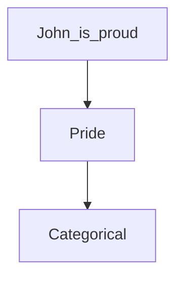

# The Intellectualist Legend
The starting point:  
1. Behavior does not count as intelligent just because it has a certain shape or form--it could always be the product of luck.
2. It is not intelligent if it has the wrong causal history.

Causal history makes not only the external behaviors intelligent, but also the internal behaviors. Those causes themselves need to be intelligent, resulting in a **regress**.

## Responses
1. The mentalistic operations can be implicit.  
*$\rightarrow$ Just hides it another level*
2. Mentalistic operations need not be the product of antecedent mental activities.  
*$\rightarrow$ No way to distinguish intelligent mental activities*

# The Category Mistake
> The difference between a normal person and an idiot is not that the normal person is really two persons while the idiot is only one *~ G. Ryle against Descartes*

1. The fundamental mistake of the Cartesian is linguistic, a mistaken understanding of mentalistic talk.

2. In reality, such talk is hypothetical in character.  
*If $x$ where ..., then $x$ would ...*: **Dispositional**
3. In this sense they can be likened to expression such as 'soluble', 'fragile', 'unstable'.
4. However, they serve to attribute complex 'multi-track' dispositions.  
{}
Subjective conditional. No accepted logic for these.
{}
5. The Cartesian thinks of the states categorically characterized as  
(i) states and activites of the mind are just like those of the body  

# Ryle's Aside

> Intelligence, just smart people being smart. I can't wait to get away. *~ Wittgenstein to Russel*  

*Knowing How and Knowing That* written to be smart, not to be clear.  

Follower of ordinary language philosophy.

# Rylean (Analytic) Behaviorism
1. Goal: Give an account of mental talk that does not involve mysterious inner entities
2. Want the account to justify saying someone is 'proud', 'cunning', etc.   

This is common in philosophy, to demystify talk of right or wrong, good or bad, etc.   

Other problems of psychological vocabulary. Involving:
* Content
* Mistake
* Rational
* etc.

## What Ryle Wants
*S* is said to be in mental state *M* if and only if *S* is *P*  
{}
This is a **reductive account**.
{}
*P* is a dispositional description.

#### How do we go about answer questions of the form "What is **X**?"  
More explicit attention to the methodology, reflecting on ordinary linguistic practice. This is what Ryle does explicitly.

## Additional Issue
All this talk of behavior. Behavior vocabulary itself comes in a variety of forms:
* Purely physically (detected by a sensor)
* Other (action type) characterizations that need interpretation  

How will we characterize that of the machine?
